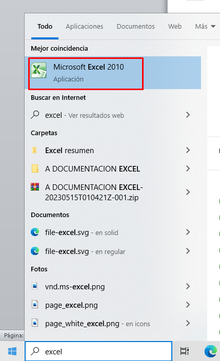

# Tabla de Contenido

- [Qué es Excel](#qué-es-excel)
- [Usos principales de Microsoft Excel](#usos-principales-de-microsoft-excel)
- [Conceptos claves sobre Excel](#conceptos-claves-sobre-excel)
- [Cómo creamos un libro en Excel](#cómo-creamos-un-libro-en-excel)
- [Cómo aplicar una operación matemática en Excel](#cómo-aplicar-una-operación-matemática-en-excel)
- [Qué son los operadores en Excel](#qué-son-los-operadores-en-excel)
- [Lista de operadores en Excel](#lista-de-operadores-en-excel)

# que es excel

Microsoft Excel es una aplicación de hoja de cálculo desarrollada por Microsoft. Se utiliza principalmente para realizar tareas relacionadas con el análisis, organización y manipulación de datos numéricos y textuales

# Usos principales de Microsoft Excel:

1. Análisis y visualización de datos.
2. Contabilidad y finanzas.
3. Gestión de proyectos.
4. Gestión de datos e inventarios.
5. Cálculos y análisis matemáticos.

# conceptos claves sobre excel

1. **Libro:** Un libro en Excel es un archivo que puede contener una o varias hojas de cálculo. Cada hoja dentro del libro es independiente y puede tener datos y fórmulas únicas.

2. **Hoja de Cálculo:** Una hoja de cálculo es una cuadrícula donde puedes organizar y manipular datos. Está compuesta por filas y columnas, y cada intersección de una fila y una columna se llama celda.

3. **Fila y Columna:** Las filas son las horizontales y las columnas son las verticales en una hoja de cálculo. Los datos se organizan en celdas que se encuentran en la intersección de una fila y una columna.

5. **Celda:** Es la unidad básica en una hoja de cálculo. Puede contener datos como números, texto o fechas. También es el lugar donde se pueden aplicar fórmulas y funciones para realizar cálculos.

6. **Rango:** Un rango es un grupo contiguo de celdas seleccionadas en una hoja de cálculo. Puede ser una fila, una columna o un grupo rectangular de celdas. Los rangos se utilizan para aplicar operaciones o fórmulas en un conjunto específico de celdas.

7. **Referencias:** Las referencias son enlaces a otras celdas o rangos en una hoja de cálculo. Pueden ser referencias relativas (cambian cuando se copian a otras celdas), referencias absolutas (no cambian) o referencias mixtas (una parte cambia, la otra no).

8. **Operaciones Matemáticas:** Excel permite realizar una variedad de operaciones matemáticas como suma, resta, multiplicación y división. Estas operaciones se pueden realizar directamente en las celdas utilizando operadores aritméticos (+, -, *, /).

9. **Fórmulas:** Las fórmulas son expresiones matemáticas o lógicas que se utilizan para realizar cálculos en Excel. Comienzan con un signo igual (=) y pueden involucrar valores numéricos, referencias a celdas, funciones y operadores para obtener resultados precisos.

# Como creamos un libro en Excel 
- metodo 1: 
Vamos a la barra de búsqueda, escribimos Excel y le damos doble clic  cuando nos aparezca el icono

- metodo 2
en algunos ordenadores, Excel está  anclado a la barra de tareas, si es asi dándole doble clic al icono de Excel podemos abir que software.

# como aplicar una operacion matematica en exel

1. **Selecciona una Celda:** Elige la celda donde deseas que aparezca el resultado de tu operación matemática.

2. **Escribe la Fórmula:** En la barra de fórmulas en la parte superior de la ventana de Excel, comienza con el signo igual (=) seguido de la operación matemática que deseas realizar. Por ejemplo, si deseas sumar dos números, escribirías algo como `=2+3` para sumar 2 y 3.

3. **Presiona Enter:** Después de escribir la fórmula, presiona la tecla "Enter" en tu teclado. El resultado de la operación matemática se calculará y aparecerá en la celda que seleccionaste.

# que son los operadores en excel

En Excel, los operadores son símbolos que se utilizan para realizar cálculos y operaciones en fórmulas y funciones. Estos operadores permiten combinar valores, realizar cálculos matemáticos y comparar datos en las hojas de cálculo. Los operadores en Excel se utilizan para determinar cómo se deben manipular los valores en las celdas y cómo se deben realizar las operaciones.

# lista de operadores en excel

En Excel, puedes utilizar varios operadores matemáticos para realizar cálculos en las fórmulas y funciones. Aquí tienes una lista de los operadores matemáticos más comunes en Excel:

1. **Suma:** `+` - Se utiliza para sumar valores. Por ejemplo, `A1 + B1` suma los valores en las celdas A1 y B1.

2. **Resta:** `-` - Se utiliza para restar valores. Por ejemplo, `C1 - D1` resta el valor en la celda D1 del valor en la celda C1.

3. **Multiplicación:** `*` - Se utiliza para multiplicar valores. Por ejemplo, `E1 * F1` multiplica los valores en las celdas E1 y F1.

4. **División:** `/` - Se utiliza para dividir valores. Por ejemplo, `G1 / H1` divide el valor en la celda G1 por el valor en la celda H1.

5. **Exponenciación:** `^` - Se utiliza para elevar un número a una potencia. Por ejemplo, `2^3` calcula 2 elevado a la potencia de 3.

6. **Módulo o Resto:** `%` - Calcula el resto después de la división. Por ejemplo, `I1 % J1` devuelve el resto de la división de I1 entre J1.

7. **Operador de Concatenación:** `&` - Se utiliza para unir cadenas de texto. Por ejemplo, ` "Hola" & " " & "Mundo"` concatenaría las tres cadenas en una sola: "Hola Mundo".

8. **Operadores de Comparación:** Puedes usar operadores de comparación para evaluar relaciones entre valores. Algunos ejemplos son `=`, `>`, `<`, `>=`, `<=`, `<>` (no igual).

9. **Operador de Rango Definido:** `:` - Este operador se utiliza para definir un rango de celdas entre dos referencias. Por ejemplo, `A1:B5` define un rango que abarca desde la celda A1 hasta la celda B5, incluyendo todas las celdas en medio.

10. **Referencia de Celda Relativa:** Cuando se escribe una referencia de celda sin ningún signo especial, como `A1`, se considera una referencia de celda relativa. Si copias una fórmula que contiene referencias relativas a otras celdas, esas referencias cambiarán automáticamente según la ubicación de la fórmula copiada.

11. **Referencia de Celda Absoluta:** Al colocar el signo de dólar `$` delante de la letra de la columna y el número de la fila en una referencia de celda, como `$A$1`, se convierte en una referencia de celda absoluta. Al copiar una fórmula con referencias absolutas, esas referencias no cambian, manteniendo la misma posición.

12. **Referencia de Columna Absoluta:** Al colocar el signo de dólar `$` solo antes de la letra de la columna, como `$A1`, se convierte en una referencia de columna absoluta. Al copiar esta fórmula en una fila diferente, la columna se mantendrá fija, pero la fila cambiará.

13. **Referencia de Fila Absoluta:** Al colocar el signo de dólar `$` solo antes del número de la fila, como `A$1`, se convierte en una referencia de fila absoluta. Al copiar esta fórmula en una columna diferente, la fila se mantendrá fija, pero la columna cambiará.

14. **Referencia Mixta:** Combina elementos de referencias relativas y absolutas. Por ejemplo, `$A1` mantiene la columna fija mientras permite que la fila cambie al copiar, y `A$1` mantiene la fila fija mientras permite que la columna cambie al copiar.

