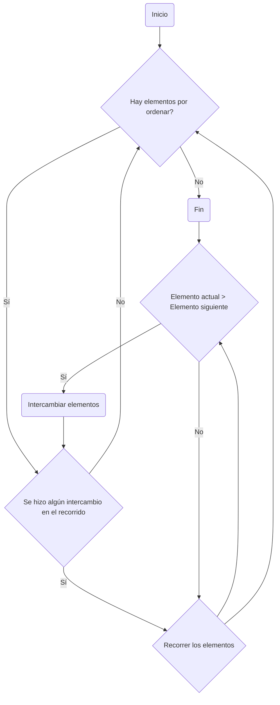

Este diagrama de flujo representa el algoritmo de ordenamiento de burbuja, donde se realiza un recorrido por la lista de elementos y se comparan los elementos adyacentes. Si el elemento actual es mayor que el siguiente, se intercambian. Este proceso se repite hasta que no haya elementos por ordenar o no se realicen intercambios en el recorrido.
