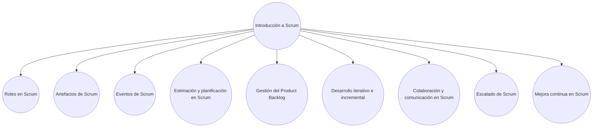
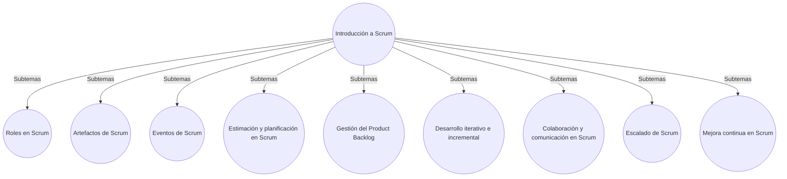

```mermaid
graph LR
    A(Introducción a Scrum) --> B(Roles en Scrum)
    A --> C(Artefactos de Scrum)
    A --> D(Eventos de Scrum)
    A --> E(Estimación y planificación en Scrum)
    A --> F(Gestión del Product Backlog)
    A --> G(Desarrollo iterativo e incremental)
    A --> H(Colaboración y comunicación en Scrum)
    A --> I(Escalado de Scrum)
    A --> J(Mejora continua en Scrum)

    B --> B1(Scrum Master)
    B --> B2(Product Owner)
    B --> B3(Equipo de Desarrollo)
    B --> B4(Interacciones y responsabilidades entre los roles)

    C --> C1(Product Backlog)
    C --> C2(Sprint Backlog)
    C --> C3(Incremento del Producto)
    C --> C4(Definition of Done)

    D --> D1(Sprint Planning)
    D --> D2(Daily Scrum)
    D --> D3(Sprint Review)
    D --> D4(Sprint Retrospective)
    D --> D5(Sprint y ciclos de trabajo)

    E --> E1(Estimación relativa - story points)
    E --> E2(Planificación de Releases)
    E --> E3(Planificación de Sprints)
    E --> E4(Gestión del tiempo y seguimiento del progreso)

    F --> F1(Creación y mantenimiento del Product Backlog)
    F --> F2(Priorización de los elementos del Product Backlog)
    F --> F3(Refinamiento y descomposición de historias de usuario)
    F --> F4(Técnicas de gestión y seguimiento del Product Backlog)

    G --> G1(Concepto de entrega de valor incremental)
    G --> G2(Planificación y ejecución de Sprints)
    G --> G3(Revisión y ajuste de objetivos en cada Sprint)
    G --> G4(Control y adaptación durante el desarrollo)

    H --> H1(Trabajo en equipo autogestionado)
    H --> H2(Facilitación de la comunicación efectiva)
    H --> H3(Transparencia y visibilidad del progreso)
    H --> H4(Resolución de conflictos y toma de decisiones)

    I --> I1(Scrum en proyectos grandes y complejos)
    I --> I2(Frameworks y prácticas de escalado)
    I --> I3(Coordinación y alineación entre equipos)
    I --> I4(Retos y consideraciones en el escalado de Scrum)

    J --> J1(Uso de retrospectivas para el aprendizaje)
    J --> J2(Adaptación y evolución del proceso)
    J --> J3(Cultura de mejora continua y aprendizaje organizacional)
    J --> J4(Herramientas y técnicas para la mejora en Scrum)
```

1. Diagrama de flujo



2. Diagrama de árbol



3. Diagrama de barras

```mermaid
bar
    title Estructura del libro de Scrum
    Introducción a Scrum : 1
    Roles en Scrum : 1
    Artefactos de Scrum : 1
    Eventos de Scrum : 1
    Estimación y planificación en Scrum : 1
    Gestión del Product Backlog : 1
    Desarrollo iterativo e incremental : 1
    Colaboración y comunicación en Scrum : 1
    Escalado de Scrum : 1
    Mejora continua en Scrum : 1
```

