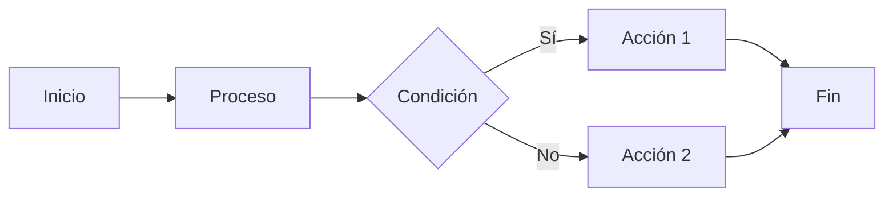
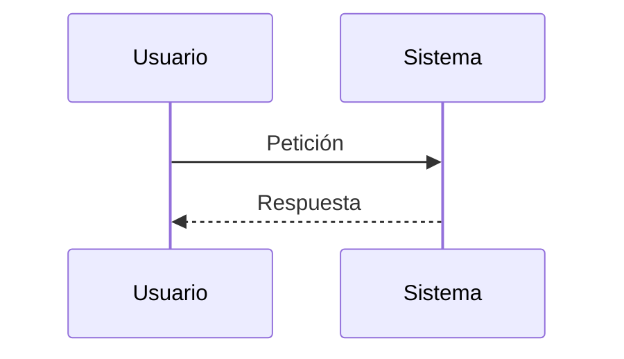
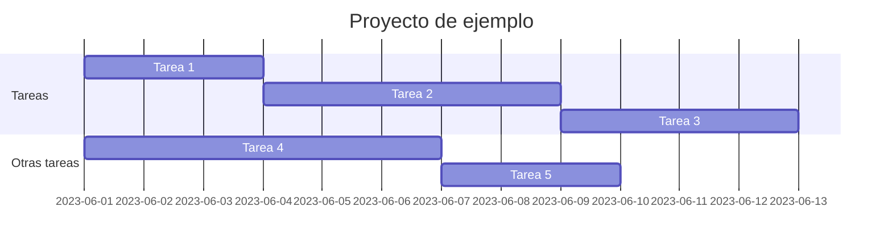
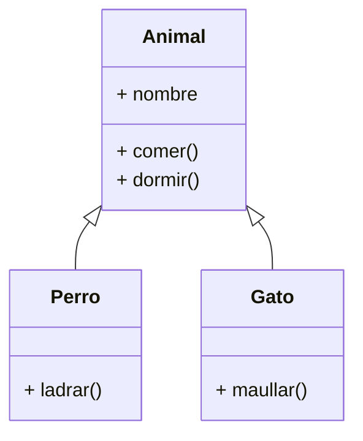
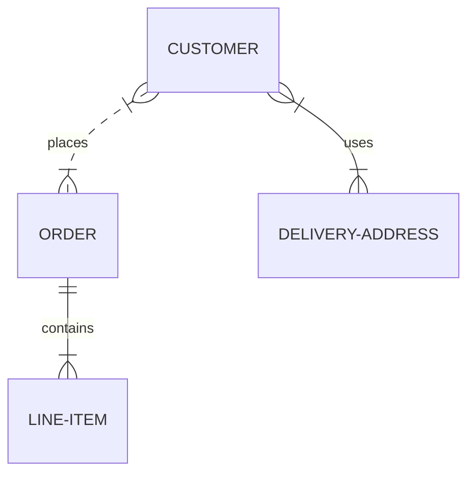

Diagramas de flujo:

```mermaid
graph LR
    A[Inicio] --> B[Proceso]
    B --> C{Condición}
    C -->|Sí| D[Acción 1]
    C -->|No| E[Acción 2]
    D --> F[Fin]
    E --> F
```

Diagramas de secuencia:

```mermaid
sequenceDiagram
    participant A as Usuario
    participant B as Sistema

    A ->> B: Petición
    B -->> A: Respuesta
```

Diagramas de Gantt:

```mermaid
gantt
    dateFormat  YYYY-MM-DD
    title Proyecto de ejemplo

    section Tareas
    Tarea 1     :a1, 2023-06-01, 3d
    Tarea 2     :a2, 2023-06-04, 5d
    Tarea 3     :a3, 2023-06-09, 4d

    section Otras tareas
    Tarea 4     :a4, 2023-06-01, 6d
    Tarea 5     :a5, 2023-06-07, 3d
```

Diagramas de clase:

```mermaid
classDiagram
    class Animal {
        + nombre
        + comer()
        + dormir()
    }
    class Perro {
        + ladrar()
    }
    class Gato {
        + maullar()
    }
    Animal <|-- Perro
    Animal <|-- Gato
```

Diagramas de entidad-relación:

```mermaid
erDiagram
    CUSTOMER }|..|{ ORDER : places
    ORDER ||--|{ LINE-ITEM : contains
    CUSTOMER }|--|{ DELIVERY-ADDRESS : uses
```

