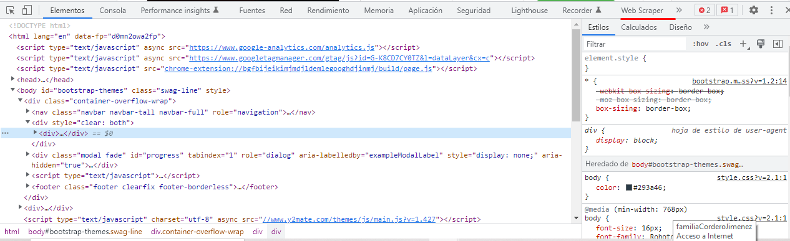
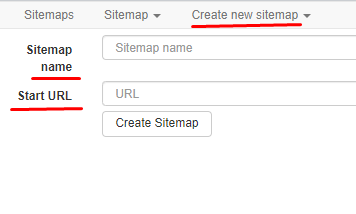
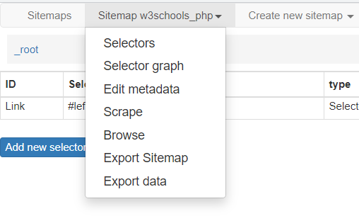

## Webscraper.io

| Sitemap |Sitemaps  Create|  Create new sitemap
|---------|:---------------|--------------------

### Crear Selectores

**Id:** nombre del selector

**Type:** Link|Element|Text

**Selector:** Select|Element preview|Data preview

**[x] Múltiple**

**Link:** este selector sirve para visitar páginas.

**Element:** selecciona un elemento html, después se puede desglosar.

**Text:** sirve para extraer un texto de un elemento.

**Selector:** abre una herramienta grafica que sirve para extraer los selectores html, si seleccionas dos elementos iguales, selecciona todos del mismo tipo

Selectors|Selectors graph|Edit metadata|Scrape|Browse|Export Sitemap|Export data
|--------|:--------------|:------------|:-----|:-----|:-------------|:----------

Para exportar datos primero se le da en **Scrape** para que realice las acciones y luego se exportan los datos

