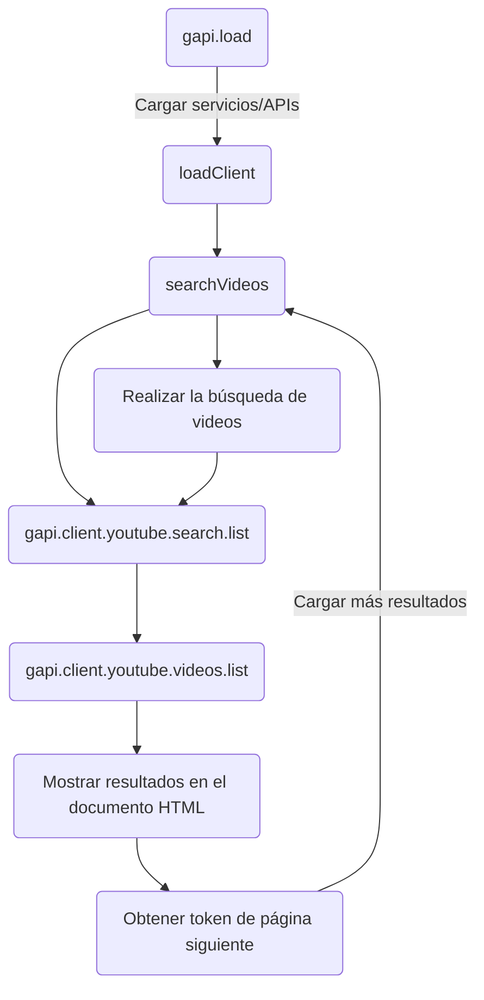

```javascript
function loadClient() {
  // ...
}

function searchVideos() {
  // ...
}

function parseDuration(duration) {
  // ...
}
ar más resultados
function loadMore() {
  // ...
}

gapi.load('client', loadClient);
```



Este código establece una clave de API de YouTube y define varias funciones para interactuar con la API de YouTube. Aquí tienes una descripción de cada función:

- `loadClient()`: Carga el cliente de la API de YouTube utilizando la clave de API proporcionada. Esta función se llama al cargar la página.
- `searchVideos()`: Realiza una búsqueda de videos en YouTube utilizando el término de búsqueda especificado por el usuario. Los resultados se muestran en el documento HTML.
- `parseDuration(duration)`: Analiza la duración del video en formato ISO 8601 y la convierte en un formato legible.
- `loadMore()`: Carga más resultados de videos utilizando el token de página siguiente. Los resultados adicionales se agregan a los resultados existentes en el documento HTML.

## gapi
- `gapi.client.setApiKey(apiKey)`: Establece la clave de API de YouTube para realizar las solicitudes a la API.
- `gapi.client.load('https://www.googleapis.com/discovery/v1/apis/youtube/v3/rest')`: Carga el cliente de la API de YouTube desde la URL especificada.
- `gapi.client.youtube.search.list(params)`: Realiza una solicitud a la API de YouTube para buscar videos. Recibe un objeto `params` que contiene los parámetros de búsqueda, como la parte, el término de búsqueda, el tipo de video, el número máximo de resultados y el token de página siguiente.
- `gapi.client.youtube.videos.list(params)`: Realiza una solicitud a la API de YouTube para obtener detalles de los videos. Recibe un objeto `params` que contiene los parámetros de búsqueda, como la parte y los IDs de video.
- `response.result.items`: Accede a los elementos de la respuesta de una solicitud a la API. En el caso de la búsqueda de videos, contiene los videos encontrados. En el caso de la obtención de detalles de videos, contiene los detalles de los videos encontrados.
- `gapi.load`: se encarga de cargar los scripts necesarios y gestionar las dependencias requeridas para el servicio/API específico que se está cargando. Esto puede incluir la carga de archivos JavaScript, la inicialización de objetos y la configuración de opciones.