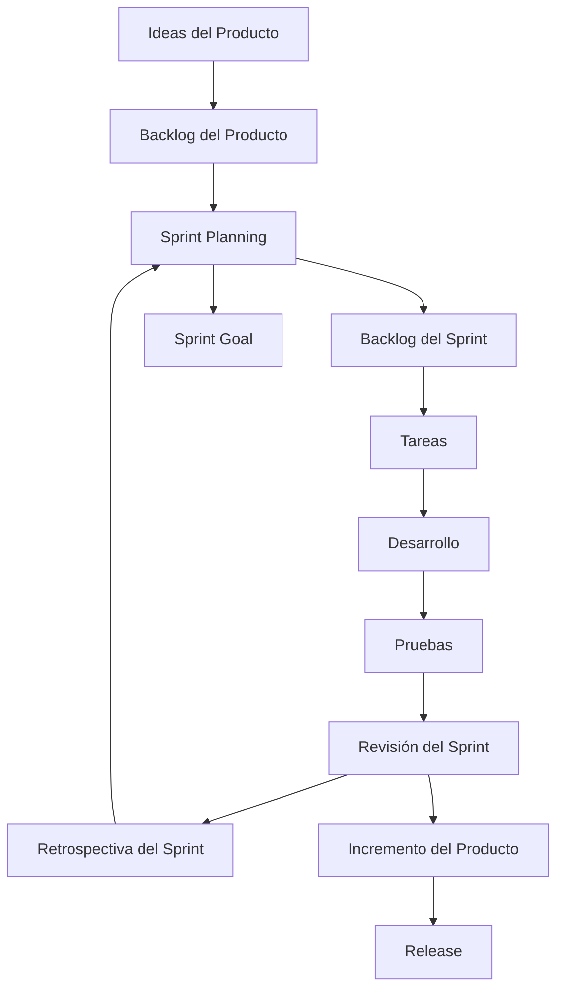

Scrum es un marco de trabajo ágil utilizado comúnmente en el desarrollo de software. Se basa en la iteración y la colaboración para entregar productos de alta calidad de manera incremental. A continuación, te mostraré un diagrama Mermaid que ilustra los principales componentes y el flujo de trabajo de Scrum.

En el diagrama, los pasos clave del flujo de trabajo de Scrum se muestran como nodos y las flechas indican la dirección del flujo. Aquí tienes una explicación de cada uno de los pasos:

1. **Ideas del Producto:** En esta etapa, se generan ideas y conceptos para el producto que se va a desarrollar.

2. **Backlog del Producto:** Las ideas se registran en el backlog del producto, que es una lista de todas las funcionalidades, mejoras y correcciones pendientes para el producto.

3. **Sprint Planning:** En esta reunión, el equipo de desarrollo selecciona las funcionalidades más importantes del backlog del producto para el próximo sprint. Estas funcionalidades se mueven al backlog del sprint.

4. **Backlog del Sprint:** Es una lista de tareas específicas que deben completarse durante el sprint actual.

5. **Sprint Goal:** Se establece un objetivo claro para el sprint actual, que guiará el trabajo del equipo de desarrollo.

6. **Tareas:** Las tareas individuales se crean a partir de los elementos del backlog del sprint y se asignan a los miembros del equipo.

7. **Desarrollo:** El equipo trabaja en las tareas del sprint, desarrollando y probando las funcionalidades.

8. **Pruebas:** Se realizan pruebas para asegurarse de que las funcionalidades desarrolladas funcionen correctamente y cumplan con los requisitos establecidos.

9. **Revisión del Sprint:** Al finalizar el sprint, se realiza una revisión para mostrar el trabajo completado al equipo de Scrum y a los interesados.

10. **Retrospectiva del Sprint:** El equipo reflexiona sobre el sprint anterior, analiza lo que funcionó bien y qué se puede mejorar, y se definen acciones para el próximo sprint.

11. **Incremento del Producto:** Se verifica y documenta el incremento del producto, que incluye todas las funcionalidades completadas durante el sprint actual.

12. **Release:** Si el incremento del producto cumple con los criterios de calidad y requisitos, se puede lanzar una versión del producto al mercado.

Este diagrama Mermaid representa un flujo de trabajo típico de Scrum, pero ten en cuenta que Scrum es altamente adaptable y puede variar según las necesidades del equipo y el proyecto.